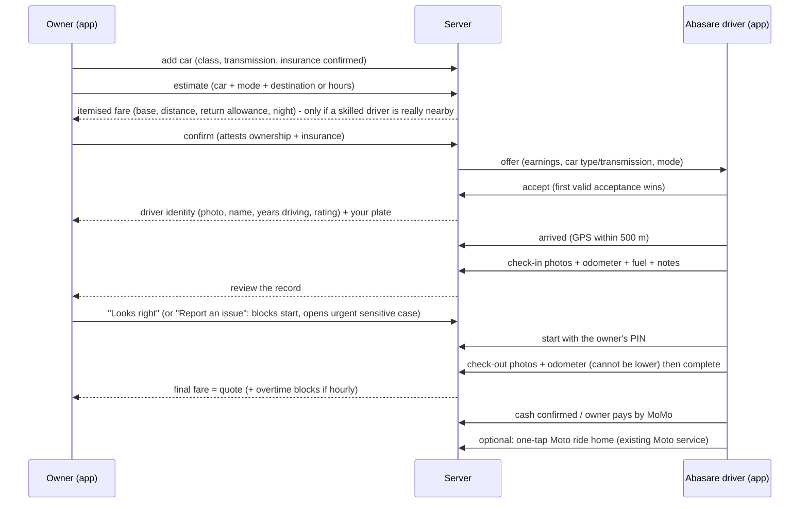

# Abasare: hire a verified driver for your own car

## 1. What Abasare is (and what I could verify)

In Rwanda, **Abasare** are professional drivers who come to *you* and drive *your own car*: classically a designated-driver service for people who have been drinking, but also for anyone who is tired, unwell, or wants a driver for a few hours. The name refers to the traditional ferrymen who helped people cross rivers.

What the public sources say (read during this work, **not** a market study):

| Source | What it says |
|---|---|
| [abasare.com](https://www.abasare.com/) | "Drivers on demand": book a ride in seconds, find nearby drivers, **transparent pricing, see the fare before you book**, verified and rated drivers, real-time tracking, multiple secure payment options, driver ratings, emergency contacts and trip sharing. Mobile apps on Google Play and the App Store. |
| [abasare.rw/contact](https://abasare.rw/contact/) | Based in Kigali; office hours Mon-Fri 8:00-18:00, Sat 9:00-16:00. |
| Search listings for the Abasare app (Google Play / App Store) | Positioned as Rwanda's on-demand service to hire a **nearby driver to drive your car when you can't**: after drinking, feeling unwell or tired, with real-time trip tracking, transparent RWF fares and safety/support paths. (The Play Store page itself could not be read in full.) |
| [KT Press](https://ktpress.rw/?p=46377) (2019) | Traditional model: customers phone drivers directly; drivers recruit at bars; option to drive the customer's car home **or** bring their own taxi; **5,000-7,000 RWF depending on distance**; 24/7; drivers report trouble with intoxicated clients on directions and **collecting payment after arrival**; demand spiked around festive seasons and after the "Gerayo Amahoro" anti-drink-driving campaign. |

**Limits:** the sites publish little about vetting, pricing rules, insurance or damage handling, so I cannot compare those precisely. The positioning below is based on what is publicly stated plus the product gaps visible in the traditional model.

## 2. How this app does it

Abasare is a **first-class service inside the same app, backend, ledger and support tools** (not a separate product). The owner switches from *Ride* to *Abasare* on the home screen.

| | Ride-hailing (existing) | Abasare (new) |
|---|---|---|
| Whose vehicle | Driver's | **The customer's own car** |
| Driver needs a vehicle | Yes (documents, inspection, insurance) | **No**; needs licence (2+ years), ID, photo, **police clearance** |
| Matching | Distance/ETA + vehicle type | Distance/ETA + **skills: car class and manual/automatic** + valid Abasare documents |
| Modes | A to B | **Drive me home** (A to B) and **By the hour** (2-12 h, long-hire rate from 8 h) |
| Price extras | Waiting | **Driver return allowance**, **night band 22:00-05:00**, overtime in 30-min blocks (hourly) |
| Start | PIN | **Car check-in (photos, odometer, fuel, notes) + owner confirmation + PIN** |
| End | Complete | **Car check-out** (photos, odometer, fuel) then complete; owner can dispute within 30 min |
| Payment | Cash / MoMo / company | Cash / MoMo / **company account** (policy-controlled) |

### Flows

### Competitive differences (design intent)

1. **Digital car handover record** (timestamped photos, odometer, fuel, notes; both parties confirm). Phone-call Abasare have nothing like it; it protects the owner from damage disputes and the driver from false claims.
2. **Skill-matched dispatch** (manual vs automatic, car/SUV/minivan/pickup/moto) so owners are not sent a driver who can't drive their car.
3. **Upfront itemised price** including the driver's return, in the 5,000-7,000 RWF band reported for night trips, instead of negotiation.
4. **Stronger vetting**: licence held 2+ years (configurable), national ID, photo, **police clearance with expiry**; documents expiring remove the driver from dispatch automatically.
5. **Hourly / scheduled hire** (events, airport, long evenings, a driver for a day) and **company billing** with spending policies.
6. **Part of a bigger network**: the driver's return can be a **one-tap Moto booking** from the drop-off point; same SOS, trip sharing, PIN, support and audit as rides.
7. **Fair earnings**: drivers see their pay before accepting; 12% introductory commission (placeholder) vs 15% default for rides.

## 3. Pricing (PLACEHOLDERS: confirm with the client)

| Item | Value |
|---|---|
| Drive me home | 2,000 base + 300/km + 100/km driver-return allowance, minimum 4,000 before fees; **+1,000 night band** (22:00-05:00 Kigali time) ; rounded to 100 |
| Hourly | 4,000/h (minimum 2 h, max 12 h); **3,500/h from 8 h**; +1,000 if the hire starts in the night band |
| Overtime (hourly) | 2,500 per started 30 minutes after a 10-minute grace |
| Free waiting (home mode) | 10 minutes, then 50/min |
| Commission | 12% (introductory) |

Examples: 5.6 km at night = **5,600 RWF**; 10 km by day = 6,000; 10 km at night = 7,000; 2 h by day = 8,000; 8 h = 28,000. All lines are shown before confirming, and the final price equals the quote except overtime/waiting that were disclosed. Changes go through the normal maker-checker approval.

## 4. Safety, trust and liability model

* **Driver identity**: the owner sees the driver's photo, name, rating, years driving and *their own* plate before handing over keys. PIN start and live trip sharing apply. SOS available (always honest about what it does).
* **Handover evidence**: at least 2 photos at check-in and at check-out (configurable), odometer (check-out cannot be lower than check-in), fuel, notes. Photos are served only through 5-minute signed links to the owner, the assigned driver and staff.
* **Disputes**: "Report an issue" at check-in blocks the start until resolved; at check-out it opens an **urgent, sensitive support case** attached to the booking (window: 30 min after drop-off, configurable). Evidence is retained while a case is open and **purged after 90 days** otherwise (photos can show personal belongings).
* **Owner attestation**: to book, the owner confirms they own the car or may let others drive it **and that its insurance allows another driver** (stored with a timestamp; expiry date optional).
* **What the platform does *not* do**: it does not insure the car, does not guarantee damage compensation, and does not assess the owner's sobriety. **Insurance and liability need legal and insurer input before launch** (see section 6).
* **Intoxicated customers**: the PIN, check-in confirmation and fare agreement are built into the app so that nothing depends on the customer remembering details later; the owner can also book on behalf of a rider (existing rider name/phone fields) or via a company account.

## 5. Implementation map

| Area | Where |
|---|---|
| Schema | `backend/migrations/002_abasare.sql` (customer cars, handovers, photos, driver skills/status, pricing columns) |
| Pricing | `services/pricing.ts` (`computeHourly`, night band, return allowance, `overtimeBlocks`), `tests/pricing.test.ts` |
| Dispatch/eligibility | `services/dispatch.ts` (skills query), `services/drivers.ts` (`abasarePermission`, `accepting`) |
| Booking | `services/bookings.ts` (quote meta, attestation, handover guards, overtime, views) |
| Handover & applications | `services/abasare.ts`, `routes/abasare.ts` |
| Admin | Console tab **Abasare**, driver detail decisions, booking detail with handover photos, pricing proposal fields |
| Mobile | `screens/cars.tsx`, Abasare mode in `passenger.tsx` (Home/Options/Track/HandoverReview), `driver.tsx` (path choice, Abasare form, accepting toggles, HandoverForm, ride-home) |
| Tests | `tests/abasare.test.ts` (13), pricing unit tests (5), browser e2e `mobile/e2e/abasare-e2e.mjs` |

### New API (see `API.md`)
`GET/POST/DELETE /users/me/cars`; `POST /abasare/apply`; `POST /fares/estimate` with `abasare:{customer_vehicle_id,hours?}`; `POST /bookings` with `customer_vehicle_id`, `owner_attested`; `POST /bookings/:id/handover/photos?phase=`; `POST /bookings/:id/handover`; `POST /bookings/:id/handover/:phase/respond`; `PATCH /drivers/me/availability {online, accepting:['ride'|'abasare']}`; `GET /admin/abasare/applications`; `POST /admin/drivers/:id/abasare-decision`.

## 6. Open questions for the client / counsel (must be answered before launch)

1. **Insurance**: does a typical Rwandan motor policy cover a hired driver? Do we need a commercial/fleet cover, a partner insurer, or a mandatory declaration? Who pays for damage when the driver is at fault? (The app records evidence; it does not decide liability.)
2. **Licensing**: is a chauffeur / driver-for-hire service regulated separately from taxi/ride-hailing? Are there rules on drivers operating a customer's vehicle commercially, or on carrying out work late at night?
3. **Police clearance**: confirm the official document name, issuing office and validity period; set the document's expiry accordingly (seed: required, with expiry).
4. **Driver status & return transport**: how drivers are classified, and whether the return allowance is treated as income or expense reimbursement.
5. **Alcohol/impairment**: any duty-of-care expectations when serving intoxicated customers; terms of service wording.
6. **Pricing**: confirm tariffs, night window, hourly packages and commission with the client and the market.

## 7. Roadmap ideas (not built)

* **Pay-before-the-trip** for night jobs: authorise MoMo at check-in so intoxicated customers don't have to pay at the end (the press names payment collection as a pain point).
* **Auto-dispatch of the return Moto** to the driver at check-out (today: one tap on the driver's screen).
* Insurance partner integration and per-trip micro-cover; damage-claim workflow with the insurer.
* Women-driver preference, "trusted driver" favourites, repeat drivers.
* Subscription/corporate monthly packages (designated-driver for staff events), airport chauffeur packages.
* Operating zones with bar/restaurant partnerships (QR code at venues).

## 8. Status

See `FEATURE_STATUS.md` (Abasare section). Backend behaviour is covered by automated tests; the screens pass a browser end-to-end run (web build). **Not yet run on a physical Android device.**
