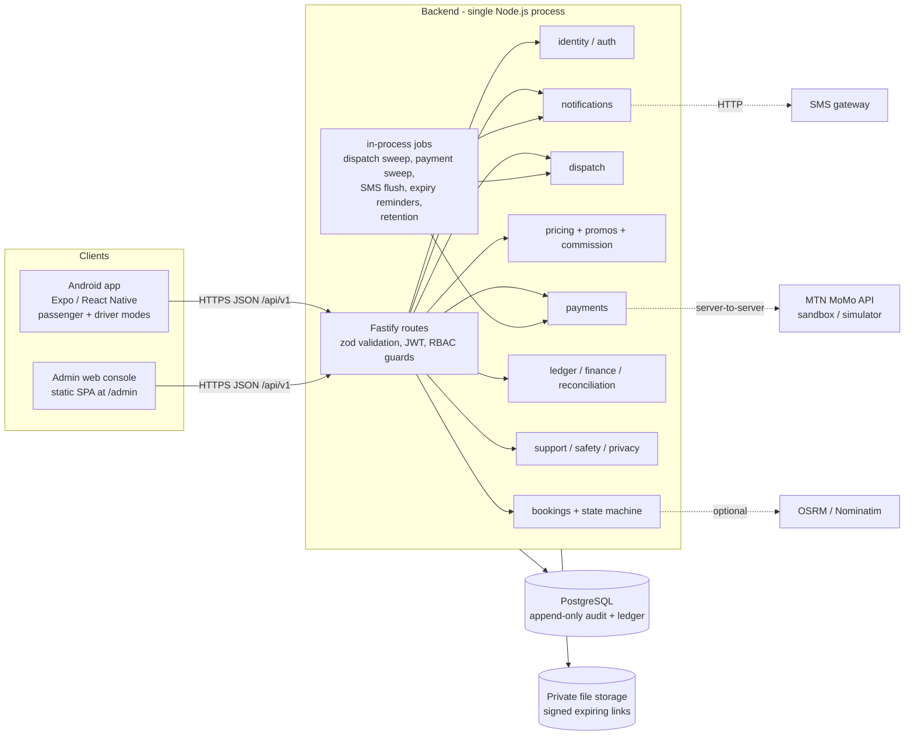
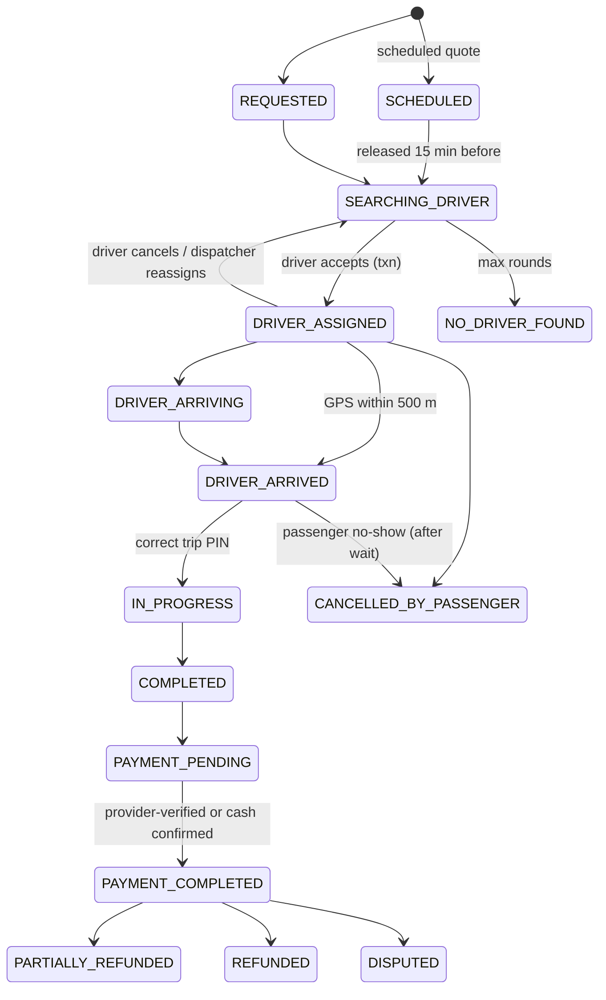

# Architecture

## Shape: a modular monolith

One deployable Node.js/TypeScript service (Fastify) with one PostgreSQL database. Modules are folders with a service layer and thin HTTP routes; there are no network hops between them, so a booking, its ledger entries and its audit record commit in **one database transaction**. Split into services only when load or team size demands it.



## Why these choices

| Decision | Reason |
|---|---|
| Node + TypeScript + Fastify | One language across API, admin and mobile; strong typing for money and state; low memory per request. |
| PostgreSQL only (no Redis, no queue broker) | Row locks, partial unique indexes and constraint triggers give the correctness guarantees we need. Jobs are idempotent sweeps over tables. Add Redis/pg-boss when measured load requires it. |
| Plain lat/lng maths instead of PostGIS | Zone polygons are small and few; haversine + point-in-polygon in the app is sufficient for the pilot. PostGIS is a drop-in upgrade for large driver fleets (GiST index on `driver_profiles`). |
| Polling (3 s, back-off) instead of WebSockets | Works on weak 3G, survives app restarts, trivially recoverable; payloads are small. SSE/WebSocket is an upgrade path, not a prerequisite. |
| Expo / React Native | One TypeScript code base for passenger and driver; Android first, iOS reuses it. |
| Map = Leaflet in a WebView + OSM tiles | No API key to launch. Replace by Mapbox/Google behind `MapBox` if coverage or terms require. |

## Correctness guarantees (and where they live)

| Guarantee | Mechanism |
|---|---|
| Valid trip transitions only | `services/bookingMachine.ts` transition table; every change takes the booking row lock and writes `booking_events` in the same transaction. |
| A driver never holds two active trips; a vehicle never double-booked | Partial unique indexes `one_active_trip_per_driver`, `one_active_trip_per_vehicle` (the database refuses even if code is wrong). |
| First acceptance wins | `acceptOffer` locks booking, offer and driver rows; concurrent accepts get `409`. |
| No duplicate bookings / charges | `Idempotency-Key` unique per passenger; one live payment per booking (partial unique index); provider events deduplicated on `(provider, reference, status)`. |
| Money is exact | Integer RWF everywhere; basis-point arithmetic with round-half-up; no floats. |
| Ledger always balances | Deferred constraint trigger rejects any unbalanced transaction at commit; ledger and audit tables reject UPDATE/DELETE. |
| Payment truth comes from the provider | Callbacks only identify the payment; status is re-queried from the provider. Client "success" is never trusted. |
| Fare terms are fixed once accepted | `fare_quotes` are immutable and carry the rule version; the final fare equals the quote unless disclosed waiting time or authorised extras apply. |

## Booking state machine


(`CANCELLED_BY_DRIVER`, `CANCELLED_BY_SYSTEM`, `CANCELLATION_REQUESTED`, `PAYMENT_REVERSED` exist in the table; a driver cancel reassigns by default so the passenger is not stranded.)

## Money flow (ledger accounts)

Per completed trip (both cash and mobile money), one balanced transaction:

```
Dr  PROVIDER_CLEARING | CASH_WITH_DRIVERS | CORPORATE_RECEIVABLE   amount the passenger paid
Dr  PROMO_EXPENSE                                                 platform-funded discount
    Cr DRIVER_PAYABLE (driver)         driver net
    Cr DRIVER_PAYABLE (fleet owner)    fleet revenue share
    Cr COMMISSION_REVENUE              platform commission
    Cr TAX_PAYABLE                     tax collected
    Cr PASSENGER_RECEIVABLE (passenger)  an earlier cancellation fee collected with this fare (only when present)
```
**Cancellation fees**: when a passenger cancels with a fee (or a driver reports a no-show), `passenger_debts` gets one row per cancelled booking (unique `booking_id`) and the ledger posts `Dr PASSENGER_RECEIVABLE / Cr CANCELLATION_FEE_REVENUE`. The next quote carries the open balance as a separate, untaxed, non-commissionable line `previous_cancellation_fee` (`breakdown.debt`); creating a booking locks the debt rows and must match the quoted amount exactly (otherwise `fee_changed`: re-quote), so one fee is carried by one booking only. A booking that ends cancelled hands the fee back; payment settlement marks it `settled` in the same transaction as the credit above. Staff waiver posts `Dr CANCELLATION_FEE_WAIVED / Cr PASSENGER_RECEIVABLE`. Corporate bookings never carry a personal fee.
A driver's **eligible payout** = `DRIVER_PAYABLE - CASH_WITH_DRIVERS` (floored at 0): cash the driver already holds is netted against what the platform owes them; a cash-only driver owes the commission (`owed_to_platform`) and remits it (`CASH_WITH_DRIVERS` ↓, `PLATFORM_BANK` ↑). Payout request moves money `DRIVER_PAYABLE → PAYOUT_CLEARING`; payment of the payout moves it to `PLATFORM_BANK`. Refunds and adjustments are new entries. **Customer prepaid wallets are deliberately not built** (separate legal review).

## Notifications, push and diagnostics

`notify()` always writes an in-app row, queues SMS for the SMS event set and queues a **push** row for time-critical kinds (`PUSH_EVENTS`: driver offers, driver assigned/arrived, Abasare assigned and handover, payment, SOS acknowledgement) using the user's language template. Workers (`src/jobs.ts`): `flushPush` every 3 s (5 attempts, then `failed`; no token -> `skipped`) and `checkPushReceipts` every minute. The adapter (`src/services/push.ts`) is `simulatedPush` unless `PUSH_PROVIDER=expo`. Tokens live in `push_tokens` (unique token; a token re-registered by another account moves to it). `POST /client-errors` stores scrubbed crash reports in `client_errors` (purged by the retention job).

## Dispatch

1. Hard filters (SQL): approved + active account, **all mandatory documents approved and unexpired**, approved suitable vehicle (type/capacity/comfort), `is_online` **and heartbeat younger than `dispatch.heartbeat_max_age_s`**, zone, no active trip, no pending offer, not already offered this booking, no safety block with this passenger.
2. Ranking: ETA, minus a small idle-time credit, plus a penalty for the unexcused-rejection rate. Excused reasons (safety, connectivity, platform error...) never count.
3. Strategy settings: `dispatch.group_size` (1 = sequential, N = small group), expanding radius per round, offer timeout, max rounds. After max rounds -> `NO_DRIVER_FOUND` with alternatives.
4. A background job (every 3 s) expires offers and advances searches; manual assign/reassign is available to dispatchers.

## Languages

The app is trilingual: Kinyarwanda (`rw`, default), French (`fr`) and English (`en`). **The UI must never mix languages**, so everything user-facing the server sends is localised per request; an `rw`/`fr` user must never see English text.

- Request language: the client sends `Accept-Language: rw|fr|en`; `reqLang()` in `src/services/errmsg.ts` reads the first tag (default `en`). A user's stored choice is `users.preferred_language`.
- Errors: `code` and `details` are stable; only `message` is localised (`localizeError()`, called from the error/404/500 handlers in `src/app.ts`). Codes with a `{min}`-style placeholder get the values from `details`. A code with no table entry returns a generic message in the user's language, never English. `tests/i18n.test.ts` fails if a user-facing code lacks an entry.
- Notifications/SMS: `DEFAULT_TEMPLATES` in `src/services/i18n.ts` (every template in every language; enumerated params such as `status`, `doc`, `phase` are translated by `VALUE_LABELS`). Admin overrides in `notification_templates` are per (key, lang).
- Public share page (`src/routes/share.ts`): language from `?lang=`, else `Accept-Language`, else `rw`; all labels including every booking status come from `SHARE_STRINGS` (tested for completeness in three languages).
- Catalogue data: `name_rw/name_fr/name_en` (+ descriptions) on `service_categories`, `name_*` on `places`; fare lines carry `label_en/label_rw/label_fr`; FAQ entries `q_*/a_*`.

Adding a language (say `xx`): add it to `SUPPORTED_LANGS`, the `Lang` unions, the zod enums (`routes/auth.ts`, `routes/catalog.ts`, `routes/me.ts`) and `/config` `languages`; add an `xx` entry to every template, `VALUE_LABELS`, the error table, `Line` labels in `services/pricing.ts` and the FAQ; add `name_xx`/`description_xx` columns in a migration (with backfill) and seed data; extend `tests/i18n.test.ts`. The mobile app keeps its own locale files in `mobile/src/lib/locales`.
