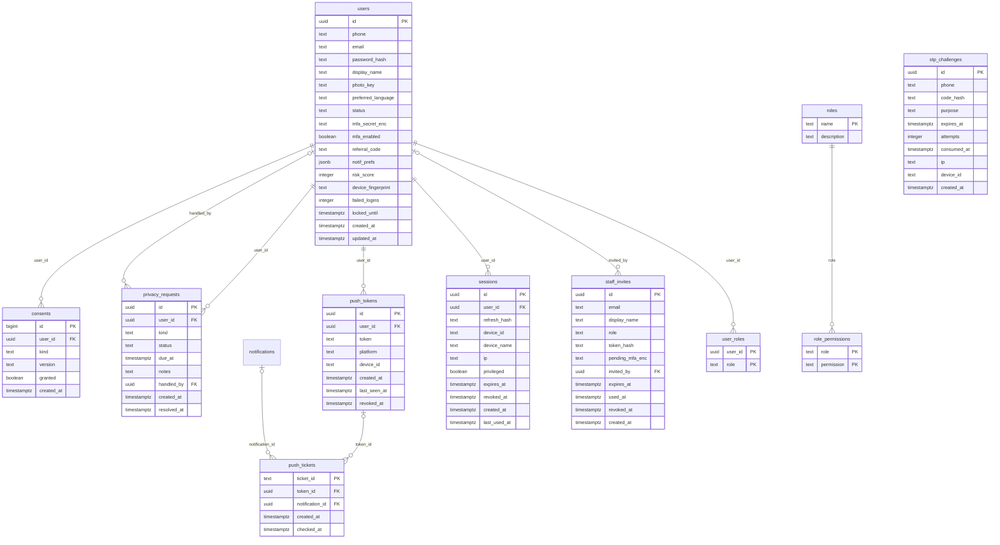
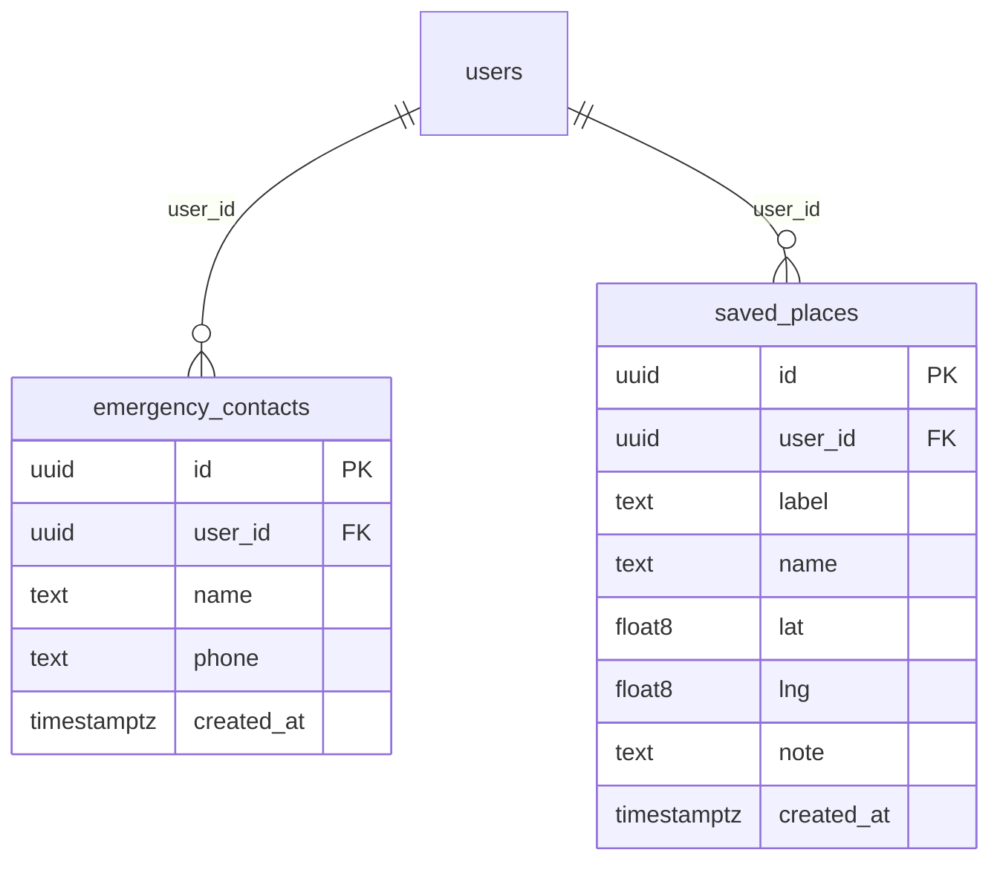
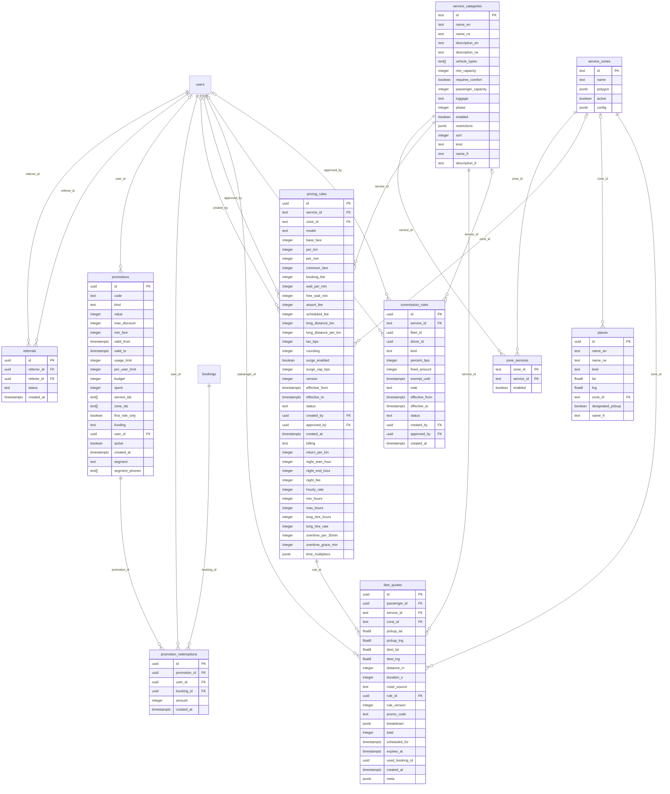
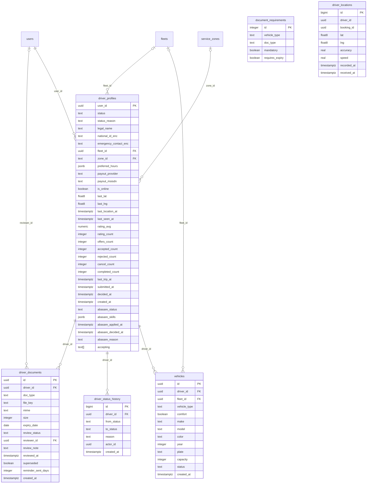
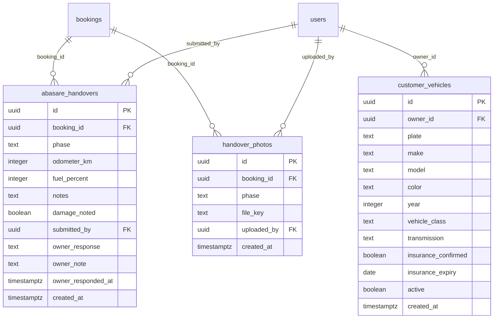
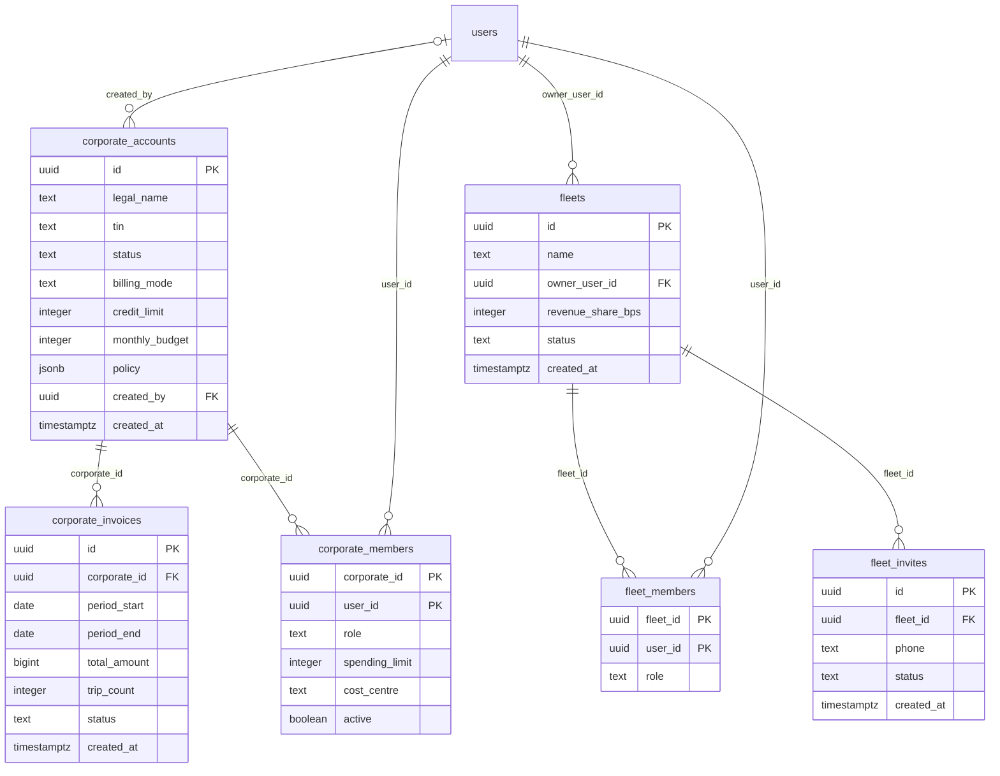
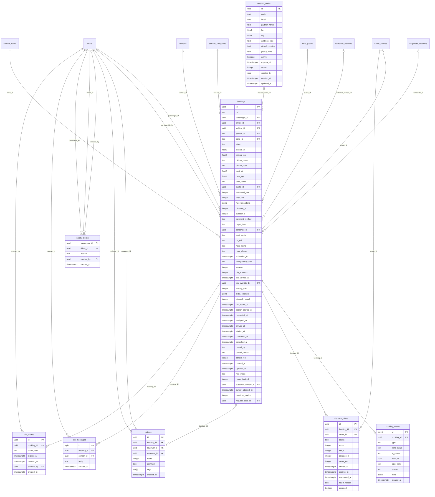
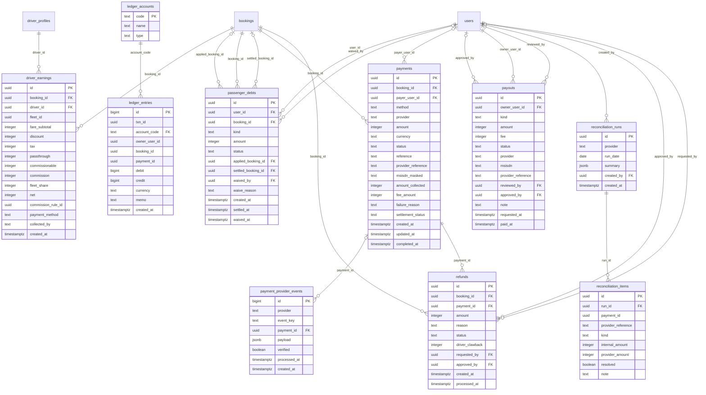
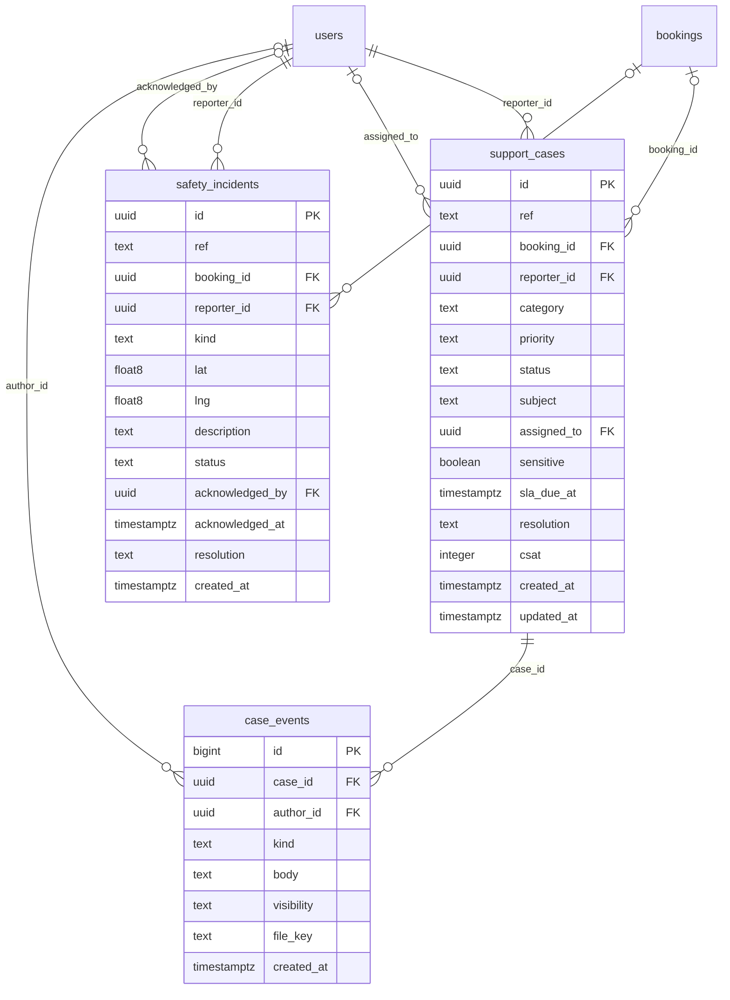
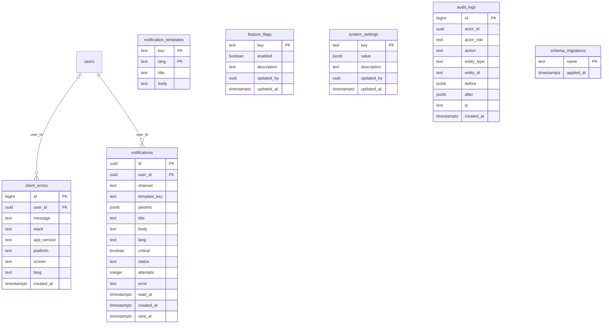

# Entity-relationship overview

> **Generated** from the migrated PostgreSQL schema by `docs/tools/gen-erd.mjs` (66 tables, 106 foreign keys, migrations 001 to 008). Do not edit by hand: change a migration, run it, then regenerate:
> `DATABASE_URL=postgres://rm:rm@localhost:5432/rwanda_mobility node docs/tools/gen-erd.mjs`

Full DDL with checks, partial unique indexes and triggers lives in [`backend/migrations/`](../backend/migrations). One diagram per module showing each table's columns and its outgoing foreign keys; a table from another module appears as a bare box where a key crosses modules. Columns are marked `PK` / `FK`. The table index lists how many columns are nullable.

## Migrations

| # | File | What it adds |
|---|---|---|
| 001 | `001_init.sql` | Core schema: identity, catalogue, pricing, drivers, bookings, payments, ledger, support, safety, audit |
| 002 | `002_abasare.sql` | Abasare: customer cars, handovers and photos, hourly/night pricing columns, driver Abasare application fields |
| 003 | `003_french.sql` | French names and descriptions for services and places |
| 004 | `004_push_cancelfee.sql` | Push tokens and tickets, client error reports, passenger cancellation-fee debts |
| 005 | `005_staff_invites.sql` | Staff invitations (single-use link, own password and authenticator) |
| 006 | `006_request_codes.sql` | Request codes (venue QR codes) and `bookings.request_code_id` |
| 007 | `007_pricing_flex.sql` | Pricing time windows (`pricing_rules.time_multipliers`), promotion audiences (`segment`, `segment_phones`) |
| 008 | `008_audit_hardening.sql` | Audit follow-ups: indexes on hot paths, case-insensitive unique e-mail |

## Identity and privacy

## Rider

## Catalogue and pricing

## Drivers and vehicles

## Abasare (own-car hire)

## Fleets and business accounts

## Bookings and dispatch

## Money

## Support and safety

## Platform

## Table index

| Table | Module | Since | Columns | Notes |
|---|---|---|---|---|
| `abasare_handovers` | Abasare (own-car hire) | 002 | 12 | 6 nullable |
| `audit_logs` | Platform | 001 | 10 | 7 nullable |
| `booking_events` | Bookings and dispatch | 001 | 10 | 5 nullable |
| `bookings` | Bookings and dispatch | 001 | 56 | altered in 002, 006; 32 nullable |
| `case_events` | Support and safety | 001 | 8 | 3 nullable |
| `client_errors` | Platform | 004 | 9 | 6 nullable |
| `commission_rules` | Catalogue and pricing | 001 | 15 | 10 nullable |
| `consents` | Identity and privacy | 001 | 6 |  |
| `corporate_accounts` | Fleets and business accounts | 001 | 10 | 3 nullable |
| `corporate_invoices` | Fleets and business accounts | 001 | 8 |  |
| `corporate_members` | Fleets and business accounts | 001 | 6 | 2 nullable |
| `customer_vehicles` | Abasare (own-car hire) | 002 | 13 | 5 nullable |
| `dispatch_offers` | Bookings and dispatch | 001 | 13 | 5 nullable |
| `document_requirements` | Drivers and vehicles | 001 | 5 |  |
| `driver_documents` | Drivers and vehicles | 001 | 14 | 5 nullable |
| `driver_earnings` | Money | 001 | 16 | 2 nullable |
| `driver_locations` | Drivers and vehicles | 001 | 9 | 3 nullable |
| `driver_profiles` | Drivers and vehicles | 001 | 33 | altered in 002; 19 nullable |
| `driver_status_history` | Drivers and vehicles | 001 | 7 | 3 nullable |
| `emergency_contacts` | Rider | 001 | 5 |  |
| `fare_quotes` | Catalogue and pricing | 001 | 21 | altered in 002; 3 nullable |
| `feature_flags` | Platform | 001 | 5 | 2 nullable |
| `fleet_invites` | Fleets and business accounts | 001 | 5 |  |
| `fleet_members` | Fleets and business accounts | 001 | 3 |  |
| `fleets` | Fleets and business accounts | 001 | 6 |  |
| `handover_photos` | Abasare (own-car hire) | 002 | 6 |  |
| `ledger_accounts` | Money | 001 | 3 |  |
| `ledger_entries` | Money | 001 | 11 | 4 nullable |
| `notification_templates` | Platform | 001 | 4 |  |
| `notifications` | Platform | 001 | 15 | 6 nullable |
| `otp_challenges` | Identity and privacy | 001 | 10 | 3 nullable |
| `passenger_debts` | Money | 004 | 13 | 6 nullable |
| `payment_provider_events` | Money | 001 | 8 | 2 nullable |
| `payments` | Money | 001 | 18 | 7 nullable |
| `payouts` | Money | 001 | 14 | 7 nullable |
| `places` | Catalogue and pricing | 001 | 9 | altered in 003; 3 nullable |
| `pricing_rules` | Catalogue and pricing | 001 | 39 | altered in 002, 007; 10 nullable |
| `privacy_requests` | Identity and privacy | 001 | 9 | 3 nullable |
| `promotion_redemptions` | Catalogue and pricing | 001 | 6 |  |
| `promotions` | Catalogue and pricing | 001 | 21 | altered in 007; 8 nullable |
| `push_tickets` | Identity and privacy | 004 | 5 | 3 nullable |
| `push_tokens` | Identity and privacy | 004 | 8 | 2 nullable |
| `ratings` | Bookings and dispatch | 001 | 8 | 2 nullable |
| `reconciliation_items` | Money | 001 | 9 | 5 nullable |
| `reconciliation_runs` | Money | 001 | 6 | 1 nullable |
| `referrals` | Catalogue and pricing | 001 | 5 |  |
| `refunds` | Money | 001 | 11 | 2 nullable |
| `request_codes` | Bookings and dispatch | 006 | 15 | 5 nullable |
| `role_permissions` | Identity and privacy | 001 | 2 |  |
| `roles` | Identity and privacy | 001 | 2 | 1 nullable |
| `safety_blocks` | Bookings and dispatch | 001 | 5 | 2 nullable |
| `safety_incidents` | Support and safety | 001 | 13 | 7 nullable |
| `saved_places` | Rider | 001 | 8 | 1 nullable |
| `schema_migrations` | Platform | 001 | 2 | 1 nullable |
| `service_categories` | Catalogue and pricing | 001 | 17 | altered in 002, 003; 5 nullable |
| `service_zones` | Catalogue and pricing | 001 | 5 |  |
| `sessions` | Identity and privacy | 001 | 11 | 4 nullable |
| `staff_invites` | Identity and privacy | 005 | 11 | 4 nullable |
| `support_cases` | Support and safety | 001 | 15 | 4 nullable |
| `system_settings` | Platform | 001 | 5 | 2 nullable |
| `trip_messages` | Bookings and dispatch | 001 | 5 |  |
| `trip_shares` | Bookings and dispatch | 001 | 7 | 1 nullable |
| `user_roles` | Identity and privacy | 001 | 2 |  |
| `users` | Identity and privacy | 001 | 18 | 9 nullable |
| `vehicles` | Drivers and vehicles | 001 | 13 | 5 nullable |
| `zone_services` | Catalogue and pricing | 001 | 3 |  |

## Unique and partial unique indexes (business rules the database enforces)

| Table | Index | Definition |
|---|---|---|
| `abasare_handovers` | `abasare_handovers_booking_id_phase_key` | `abasare_handovers USING btree (booking_id, phase)` |
| `bookings` | `bookings_passenger_id_idempotency_key_key` | `bookings USING btree (passenger_id, idempotency_key)` |
| `bookings` | `bookings_ref_key` | `bookings USING btree (ref)` |
| `bookings` | `one_active_trip_per_driver` | `bookings USING btree (driver_id) WHERE ((driver_id IS NOT NULL) AND (status = ANY (ARRAY['DRIVER_ASSIGNED'::text, 'DRIVER_ARRIVING'::text, 'DRIVER_ARRIVED'::text, 'AWAITING_PASSENGER_VERIFICATION'::text, 'IN_PROGRESS'::text])))` |
| `bookings` | `one_active_trip_per_vehicle` | `bookings USING btree (vehicle_id) WHERE ((vehicle_id IS NOT NULL) AND (status = ANY (ARRAY['DRIVER_ASSIGNED'::text, 'DRIVER_ARRIVING'::text, 'DRIVER_ARRIVED'::text, 'AWAITING_PASSENGER_VERIFICATION'::text, 'IN_PROGRESS'::text])))` |
| `bookings` | `one_open_request_per_passenger` | `bookings USING btree (passenger_id) WHERE ((payer_type = 'passenger'::text) AND (scheduled_for IS NULL) AND (status = ANY (ARRAY['REQUESTED'::text, 'SEARCHING_DRIVER'::text, 'DRIVER_ASSIGNED'::text, 'DRIVER_ARRIVING'::text, 'DRIVER_ARRIVED'::text, 'AWAITING_PASSENGER_VERIFICATION'::text, 'IN_PROGRESS'::text])))` |
| `corporate_invoices` | `corporate_invoices_corporate_id_period_start_period_end_key` | `corporate_invoices USING btree (corporate_id, period_start, period_end)` |
| `customer_vehicles` | `customer_vehicles_owner_id_plate_key` | `customer_vehicles USING btree (owner_id, plate)` |
| `dispatch_offers` | `dispatch_offers_booking_id_driver_id_key` | `dispatch_offers USING btree (booking_id, driver_id)` |
| `document_requirements` | `document_requirements_vehicle_type_doc_type_key` | `document_requirements USING btree (vehicle_type, doc_type)` |
| `driver_earnings` | `driver_earnings_booking_id_key` | `driver_earnings USING btree (booking_id)` |
| `fleet_invites` | `fleet_invites_fleet_id_phone_key` | `fleet_invites USING btree (fleet_id, phone)` |
| `passenger_debts` | `passenger_debts_booking_id_key` | `passenger_debts USING btree (booking_id)` |
| `payment_provider_events` | `payment_provider_events_event_key_key` | `payment_provider_events USING btree (event_key)` |
| `payments` | `one_live_payment_per_booking` | `payments USING btree (booking_id) WHERE (status = ANY (ARRAY['INITIATED'::text, 'PENDING'::text, 'SUCCESS'::text]))` |
| `payments` | `payments_reference_key` | `payments USING btree (reference)` |
| `promotion_redemptions` | `promotion_redemptions_booking_id_key` | `promotion_redemptions USING btree (booking_id)` |
| `promotions` | `promotions_code_key` | `promotions USING btree (code)` |
| `push_tokens` | `push_tokens_token_key` | `push_tokens USING btree (token)` |
| `ratings` | `ratings_booking_id_reviewer_id_key` | `ratings USING btree (booking_id, reviewer_id)` |
| `referrals` | `referrals_referee_id_key` | `referrals USING btree (referee_id)` |
| `request_codes` | `request_codes_code_key` | `request_codes USING btree (code)` |
| `safety_incidents` | `safety_incidents_ref_key` | `safety_incidents USING btree (ref)` |
| `sessions` | `sessions_refresh_hash_key` | `sessions USING btree (refresh_hash)` |
| `staff_invites` | `staff_invites_token_hash_key` | `staff_invites USING btree (token_hash)` |
| `support_cases` | `support_cases_ref_key` | `support_cases USING btree (ref)` |
| `trip_shares` | `trip_shares_token_hash_key` | `trip_shares USING btree (token_hash)` |
| `users` | `users_email_key` | `users USING btree (email)` |
| `users` | `users_email_lower_uniq` | `users USING btree (lower(email)) WHERE (email IS NOT NULL)` |
| `users` | `users_phone_key` | `users USING btree (phone)` |
| `users` | `users_referral_code_key` | `users USING btree (referral_code)` |
| `vehicles` | `one_active_vehicle_per_driver` | `vehicles USING btree (driver_id) WHERE (status = 'approved'::text)` |
| `vehicles` | `vehicles_plate_key` | `vehicles USING btree (plate)` |

## Triggers

| Table | Trigger |
|---|---|
| `audit_logs` | `audit_immutable` |
| `ledger_entries` | `ledger_balanced` |
| `ledger_entries` | `ledger_immutable` |

## Notable guarantees

* `ledger_balanced` (deferred constraint trigger): sum(debit) = sum(credit) per `txn_id`; `ledger_immutable` and `audit_immutable` reject UPDATE and DELETE.
* One active trip per driver and per vehicle, one open request per passenger, one live payment per booking, one active vehicle per driver (partial unique indexes above).
* `bookings (passenger_id, idempotency_key)`, `payments.reference`, `driver_earnings.booking_id` and `passenger_debts.booking_id` (one cancellation-fee debt per cancelled trip) are unique; staff e-mail is unique case-insensitively (`users_email_lower_uniq`).
* Phone check `^\+250[0-9]{9}$`; money columns are integers (RWF) with `>= 0` checks; request codes match `^[A-HJ-NP-Z2-9]{6,8}$`.
