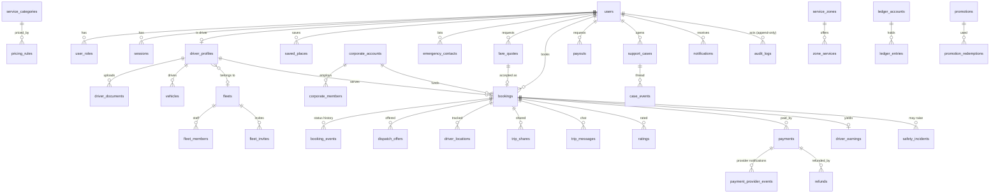

# Entity-relationship overview

Full DDL: `backend/migrations/001_init.sql` (constraints, partial unique indexes, triggers). Diagram shows the core relationships.

## Tables by module

| Module | Tables |
|---|---|
| Identity | `users`, `user_roles`, `roles`, `role_permissions`, `otp_challenges`, `sessions`, `consents`, `privacy_requests` |
| Rider | `saved_places`, `emergency_contacts` |
| Catalogue | `service_categories`, `service_zones`, `zone_services`, `places` |
| Pricing | `pricing_rules` (versioned, effective-dated, maker-checker status), `commission_rules`, `fare_quotes`, `promotions`, `promotion_redemptions`, `referrals` |
| Drivers | `driver_profiles`, `driver_documents`, `document_requirements`, `driver_status_history`, `vehicles` |
| Fleet / corporate | `fleets`, `fleet_members`, `fleet_invites`, `corporate_accounts`, `corporate_members`, `corporate_invoices` |
| Booking | `bookings`, `booking_events`, `dispatch_offers`, `driver_locations`, `trip_shares`, `trip_messages`, `ratings`, `safety_blocks` |
| Money | `payments`, `payment_provider_events`, `ledger_accounts`, `ledger_entries`, `driver_earnings`, `payouts`, `refunds`, `reconciliation_runs`, `reconciliation_items` |
| Support / safety | `support_cases`, `case_events`, `safety_incidents` |
| Platform | `notifications`, `notification_templates`, `feature_flags`, `system_settings`, `audit_logs` |

## Notable constraints

* `ledger_balanced` constraint trigger (deferred): sum(debit) = sum(credit) per `txn_id`.
* `ledger_immutable`, `audit_immutable`: UPDATE/DELETE raise.
* `one_active_trip_per_driver`, `one_active_trip_per_vehicle`, `one_open_request_per_passenger`, `one_live_payment_per_booking`, `one_active_vehicle_per_driver`.
* `bookings (passenger_id, idempotency_key)` unique; `payments.reference` unique; `driver_earnings.booking_id` unique (settle exactly once).
* Phone check `^\+250[0-9]{9}$`; amounts `>= 0`; integer money columns.
